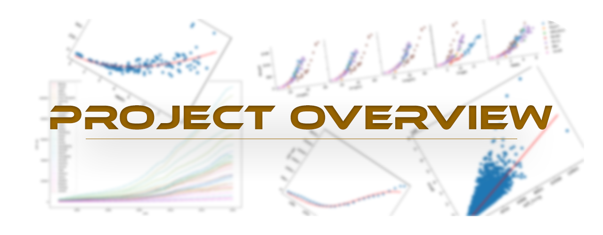
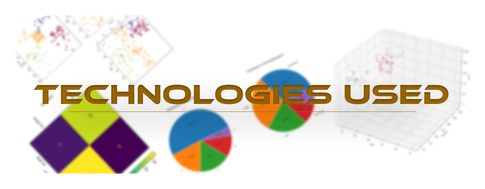
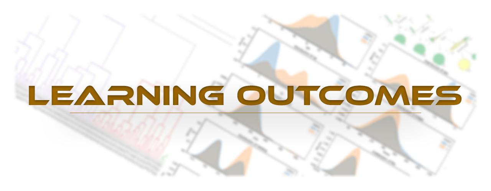
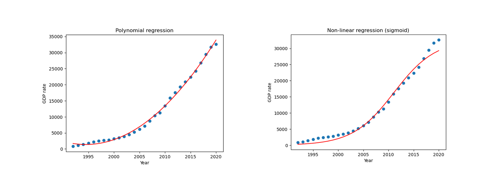

<h1>Project MLP: Machine Learning Portfolio</h1>

**Project MLP**, which stands for **Machine Learning Portfolio**, is a collection of mini machine learning projects designed to showcase my understanding of ML concepts. I created this repository to evaluate my skills in ML and my capability to solve real-world problems. Throughout this project, I gained valuable insights into plotting different types of data and applying various algorithms to address them.

<h3>Projects Included</h3>

1. [**House Price Prediction**](src/regression/linear/house-price-regression.ipynb): Using simple and multiple linear regression.

2. [**China's GDP Prediction**](src/regression/none-linear/china-gdp-regression.ipynb): Utilizing non-linear regression (sigmoid function).

3. [**Fish Weight Prediction**](src/regression/polynomial/fish-weight-regression.ipynb): Implementing simple and multiple polynomial regression.

4. [**Customer Churn Detection**](src/classification/decision-tree/churn-detection-decision-tree.ipynb): Applying decision trees.

5. [**Heart Attack Probability Prediction**](src/classification/k-nearest-neighbors/heartattack-prediction-knn.ipynb): Utilizing the k-nearest neighbors algorithm.

6. [**Wine Quality Prediction**](src/classification/logistic-regression/wine-quality-prediction-LR.ipynb): Using logistic regression.

7. [**Student Performance Prediction**](src/classification/support-vector-machine/student-performnace-prediction-SVM.ipynb): Applying the support vector machine algorithm.

8. **Customer Segmentation**: Utilizing three different algorithms:
   
   - [K-means](src/clustering/customers-kmeans-clustering.ipynb)
   - [DBSCAN](src/clustering/customers-dbscan-clustering.ipynb)
   - [Hierarchical/Agglomerative Clustering](src/clustering/customers-hierarchical-clustering.ipynb)

9. **Movie Recommendation System**: Implementing two different algorithms:
   
   - [Content-Based Filtering](src/recommendation-system/contentbased-movie-recommendation.ipynb)
   - [Collaborative User-Based Filtering](src/recommendation-system/contentbased-movie-recommendation.ipynb)

- Python programming language
- Jupyter Notebook
- NumPy library for mathematical purposes, array/matrix manipulations, and more
- Pandas library for DataFrame and dataset manipulations
- Scikit-learn library for machine learning models, preprocessing datasets, and model evaluation
- Matplotlib library for plotting and visualization
- Seaborn library for styling and creating pair plots
- Plotly library for interactive plots
- Dtreeviz library for visualizing decision trees
- SciPy library for optimization and dendrogram clustering

- The application of various machine learning algorithms and their suitability for different types of problems.
- Data preprocessing techniques and their impact on model performance, such as one-hot encoding, label encoding, train-test splitting, normalizing with different methods (e.g., standardization or min-max scaling), and more.
- The importance of data visualization in understanding model outputs and improving insights.
- The need for careful analysis and consideration. For example, in GDP prediction, while a growth rate plot might suggest a polynomial relationship, it's important to recognize that moving from 0 to 0.9 is relatively easy, whereas moving from 0.9 to 1 is more challenging. Developing countries can progress more easily by following the paths of developed countries, while developed countries must innovate to achieve further growth, which led me to use a sigmoid non-linear function instead of a polynomial one.

- Sometimes, finding that there is no relationship between two parameters can be as insightful as discovering a relationship. For instance, in student performance prediction, understanding that there may not be a straightforward relationship between weekly study hours and better grades led me to consider the possibility of a hyperplane in a higher-dimensional space, which ultimately helped in solving the problem using the support vector machine algorithm.
- Hands-on experience with multiple libraries and tools commonly used in the machine learning field.

<h3>Future Directions</h3>

I plan to explore deep learning and additional classic ML algorithms. If I discover any new mini-projects that align with this portfolio, I will gladly include them!

<h3>Questions and Feedback</h3>

If you have any questions or feedback regarding this project, please feel free to contact me. I welcome any thoughts or suggestions you may have!

If you enjoyed my work or found this portfolio helpful, please consider giving it a star! Your support encourages me to keep improving and sharing my projects with the community. Thank you!
